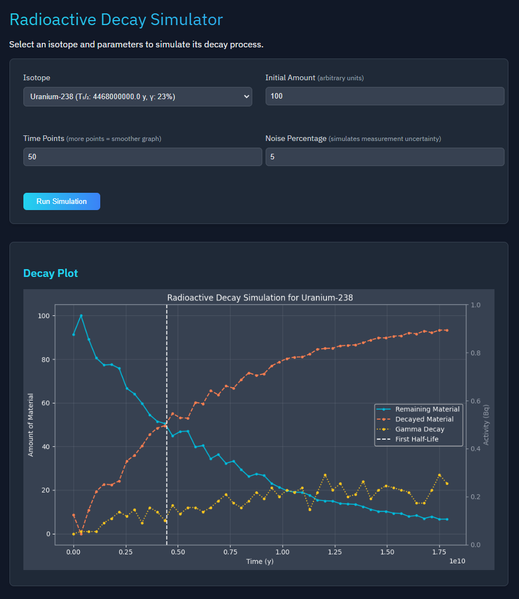
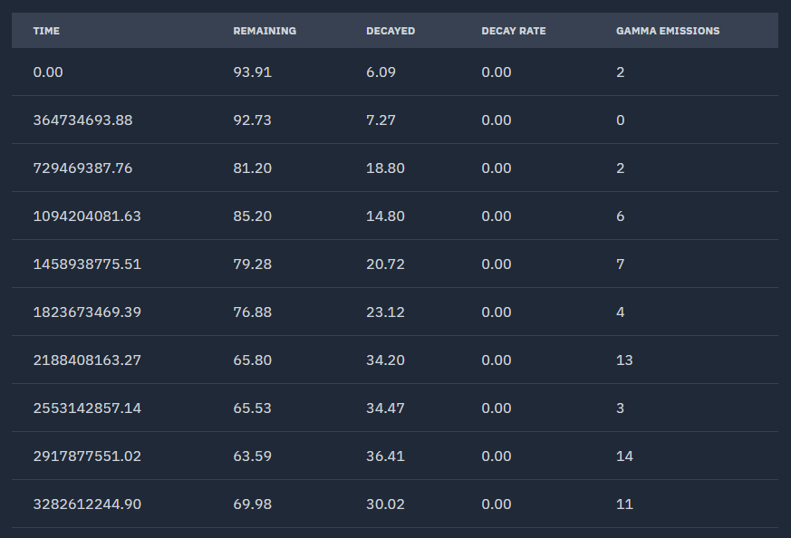

# Radioactive Decay Simulator

## Table of Contents

- [Introduction](#introduction)
- [Overview](#overview)
- [Key Features](#key-features)
- [Installation](#installation)
  - [Cloning the Repository](#cloning-the-repository)
  - [Setting Up the Virtual Environment](#setting-up-the-virtual-environment)
  - [Installing Dependencies](#installing-dependencies)
  - [Running Tests](#running-tests)
  - [Running the App](#running-the-app)
- [Development Notes](#development-notes)
- [Technologies](#technologies)
- [Interface](#interface)
- [Formulas](#formulas)
  - [Decay Constant](#decay-constant)
  - [Rate of Decay](#rate-of-decay)
  - [Decay Chains](#decay-chains)
- [Unit Conversions](#unit-conversions)
- [Resources](#resources)

## Introduction

### Modeling Half-Life and Nuclear Decay

A web-based tool for simulating radioactive decay through half-life calculations and statistical modeling.

## Overview

Radioactive decay is a fundamental process in nuclear physics where unstable atomic nuclei transform into more stable forms. While the exact moment of decay for any single atom is unpredictable, large populations of atoms follow mathematical patterns that can be modeled using statistical methods. This simulator models those patterns, allowing users to visualize decay curves, calculate remaining material over time, and explore the half-life behavior of different isotopes.


*I-131 decay simulation done over 100 time-steps*

## Key Features

*Some ideas, to review--*

- **Half-Life Calculator:** predicts the remaining amount of radioactive substance at any given time
- **Interactive Decay Curves:** visualizes how radioactive materials change over time
- **User-Friendly Interface:** makes complex decay calculations simple to understand
- **Unit Conversion:** supports conversion between common time units

- ? **Decay Chain Modeling:** would be cool to add a visualization of the parent to daughter isotope transformation. Need to figure out how we would even do that though. Can be a later goal.

## Isotope Selection and Justification

The application features a selected group of isotopes from a much larger sample of radioactive isotopes. Since there are far more radioactive isotopes than could be reasonably implemented, we focused on those that are most relevant for a meaningful decay simulation. We prioritized scientific importance, real-world applications, and educational value. The final selection is grouped into three main categories: 

### I. Natural Decay Series

There are three radioactive decay chains found in nature, plus one artificial series. These decay chains define the primary sources of natural radioactivity in the Earth's crust and are responsible for a majority of the background radiation present today. Each chain begins with a long-lived parent isotope and ends in a stable lead isotope.

**Decay Chains**

- Uranium Series / Radium Series

  - U-238 → Pb-206
  
  - 4.5 billion year process

  - Significance: most abundant radioactive decay chain, found in uranium ores

- Thorium Series / Thorium Cascade

  - Th-232 → Pb-208
  
  - 14 billion year process

  - Significance: contributes to natural gamma radiation

- Actinium Series / Actinium Cascade

  - U-235 → Pb-207
  
  - 700 million year process

  - Significance: U-235 is a key fissile material used in nuclear reactors and bombs

- Neptunium Series / Neptunium Cascade, Artificial

  - Np-237 → Bi-209
  
  - 2.1 million year process

  - Significance: does not naturally occur on Earth today; Np-237 is a byproduct of nuclear reactors and weapons testing

**Sources**

- [Actinide Alpha Decay Chains](https://en.wikipedia.org/wiki/Decay_chain#Actinide_alpha_decay_chains)

- [Natural Radioactivity](https://www.sciencedirect.com/topics/physics-and-astronomy/natural-radioactivity#:~:text=Natural%20radioactivity%20refers%20to%20the,or%20longer%20than%20Earth's%20age.)

- [Natural Decay Chains](https://www.euronuclear.org/glossary/decay-chains-natural/#:~:text=Uranium%2D235%20is%20at%20the,lead%2D208%20is%20the%20shortest.)

### II. Medical and Industrial Isotopes

The isotopes in this category are widely used in radiotherapy, imaging, and cancer treatment. They allow us to model real-world nuclear medicine applications, such as how quickly a therapeutic dose decays in a patient's body (e.g., I-131) and how medical isotopes are produced and utilized (e.g., Mo-99 → Tc-99m for imaging). Additionally, these isotopes demonstrate radiation's industrial uses, such as Co-60 for sterilization.

**Isotope Justification**

Some examples of real-world uses for the selected isotopes:

- I-131: thyroid cancer treatment, imaging

- Tc-99m: most widely used medical imaging isotope

- Co-60: radiotherapy (gamma-ray cancer treatment), industrial sterilization

- Cs-137, Sr-90: cancer radiotherapy, food irradiation, industrial applications

- P-32: leukemia and polycythemia vera treatment

- Y-90, Lu-177: targeted radiotherapy (cancer)

- Mo-99: decays into Tc-99m

- Ir-192: internal cancer treatment

**Sources**

- [Radioisotopes in Medicine](https://world-nuclear.org/information-library/non-power-nuclear-applications/radioisotopes-research/radioisotopes-in-medicine)

- [Appendix AA: List of Some Major Uses of Radioisotopes in the United States](https://www.nrc.gov/docs/ML2130/ML21300A317.pdf)

- [Isotopes in Medicine](https://www.advancingnuclearmedicine.com/knowledgebase/nuclear-medicine-facts/isotopes-in-medicine)


### III. Major Fission Products

These are the most common byproducts of nuclear fission, especially from nuclear reactors and nuclear explosions. They allow us to model nuclear waste decay, reactor monitoring, and the long-term hazards of fallout isotopes.

**Isotope Justification**

Some reasons the selected isotopes were included:

- Cs-137, Sr-90: contribute to nuclear reactor waste (high-energy beta decay)

- I-131: short-lived, highly radioactive fission product (impacts nuclear accidents like Chernobyl)

- Xe-133, Kr-85: gaseous fission products that impact reactor monitoring

- Ru-106, Ce-144, Zr-95: common in nuclear reactor byproducts and fallout

**Sources**

- [Fission Product Nuclear Data (FPND) Vol.III, International Atomic Energy Agency 1974](https://www-nds.iaea.org/publications/tecdocs/iaea-0169-volume3.pdf)

- [Radioactive Substances in the Environment, U.S. Environmental Protection Agency (EPA)](https://www.epa.gov/sites/default/files/2015-11/documents/partb_8.pdf?)

- [Fission Product Yield](https://en.wikipedia.org/wiki/Fission_product_yield)

- [Nuclear Fission Product](https://en.wikipedia.org/wiki/Nuclear_fission_product)

## Installation

### Cloning the Repository

```sh
git clone https://github.com/katerib/radioactive-decay-sim.git
```

### Setting Up the Virtual Environment

Navigate to the project directory:

```sh
cd ./radioactive-decay-sim/
```

Create a virtual environment:

```sh
python -m venv venv
```

Activate the virtual environment:

*Note: You have to activate the venv for each instance of your shell*

- **Windows:**

```ps
venv/Scripts/activate
```

- **macOS:**

```sh
source venv/bin/activate
```

### Installing Dependencies

Install the required packages:

```sh
pip install -r requirements.txt
```

Install the package in development mode:

```sh
pip install -e .
```

*If you want to install with development dependencies, run:*

```sh
pip install -e ".[dev]"
```

### Running Tests

```sh
pytest tests/
```

### Running the App

From the root of your directory, start the app:

```sh
python run.py
```

You can now access your Flask app: [localhost:5000](http://127.0.0.1:5000/)

## Development Notes

- The package is installed in editable mode (`-e` flag), so code changes will be reflected immediately without reinstallation.
- When adding new dependencies, add them to both `requirements.txt` and `setup.py`.

## Technologies

Core Technologies:

- Python
- Flask
- NumPy
- Matplotlib
- JavaScript
- HTML/CSS

Additional Python Libraries:

- dataclasses (for data modeling)
- io (for image handling)
- base64 (for image encoding)

## Interface

### Decay Visualization


*Interactive plot showing remaining material (cyan), decayed material (coral), and gamma emissions (yellow) over time for Uranium-238*

### Data Table


*Detailed numerical data showing the simulation results at each time point for Uranium-238*

## Formulas

### Decay Constant

The rate that characterizes radioactive decay. Represents how quickly a specific radioactive material decays over time. Each isotope has its own unique decay constant calculated from its half-life.

$$
λ = \frac{\ln(2)}{t_{1/2}}
$$

- λ = decay constant of radioactive isotope
- ln(2) ≈ 0.693
- t₁/₂ = half-life

### Exponential decay formula 

The exponential decay equation that models how the amount of radioactive material changes over time. This describes the relationship between the initial amount, decay constant, and time elapsed.

$$
N(t) = N_0 -e^{-\lambda t}
$$

Where:

- N(t) = amount remaining at time t
- N₀ = initial amount
- λ = decay constant of radioactive isotope
- t = time elapsed

Derived quantities:

- λN(t) = current decay rate
- N(t) = amount remaining
- N₀ - N(t) = amount decayed

### Decay Chains

*We can remove/ignore this if we aren't going to show how a specific isotope decays into another. Just putting here to save it for now.*

Describes how one radioactive isotope transforms into another through sequential decay steps.

$$
N_2(t) = N_{10} \left[ \frac{λ_1}{λ_2 - λ_1} \right] \left[e^{-λ_1 t} - e^{-λ_2 t} \right]
$$

Where:

- N₂(t) = amount of daughter isotope at time t
- N₁₀ = initial amount of parent isotope
- λ₁ = decay constant of parent
- λ₂ = decay constant of daughter

## Unit Conversions

### Time Conversions

- 1 year = 31,556,926 seconds
- 1 day = 86,400 seconds

## Resources

- [World Health Organization - The International Pharmacopoeia, Radiopharmaceuticals: General Monograph](https://www.who.int/docs/default-source/medicines/norms-and-standards/current-projects/qas13-542rev2-general-chapter-radiopharmaceuticals.pdf?sfvrsn=516dbf81_2)

- [Department of Chemistry, Federal University of Technology - Decay Equation Derivation](https://www.researchgate.net/profile/Chidi-Duru/publication/321018215_DERIVATION_OF_A_SIMPLIFIED_RADIOACTIVE_DECAY_EQUATION/links/5a083cf3aca272ed279f18da/DERIVATION-OF-A-SIMPLIFIED-RADIOACTIVE-DECAY-EQUATION.pdf)

- [HyperPhysics - Radioactive Decay Fundamentals](http://hyperphysics.phy-astr.gsu.edu/hbase/Nuclear/radact.html)

- [Japan Atomic Energy Agency](https://wwwndc.jaea.go.jp/NuC/)

- Khan Academy - Nuclear Physics Educational Content:

  - [Radioactive Decay Types](https://www.khanacademy.org/science/in-in-class-12th-physics-india/nuclei/in-in-nuclear-physics/a/radioactive-decay-types-article)

  - [Nuclear Physics: Half-Life](https://www.khanacademy.org/science/highschool-physics/x6679aa2c65c01e53:nuclear-physics/x6679aa2c65c01e53:half-life/v/half-life-radiometric-dating)

  - [Radioactive Decay](https://www.khanacademy.org/science/highschool-physics/x6679aa2c65c01e53:nuclear-physics/x6679aa2c65c01e53:radioactive-decay/v/intro-to-radioactive-decay)
